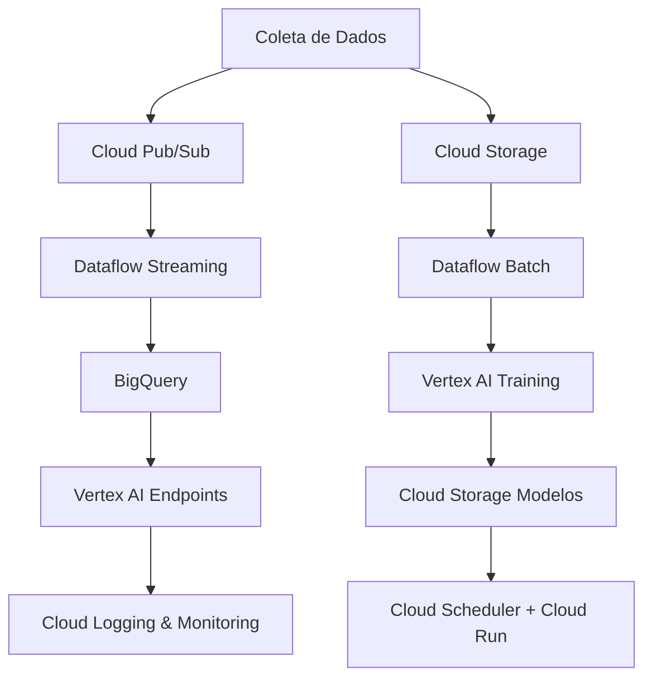
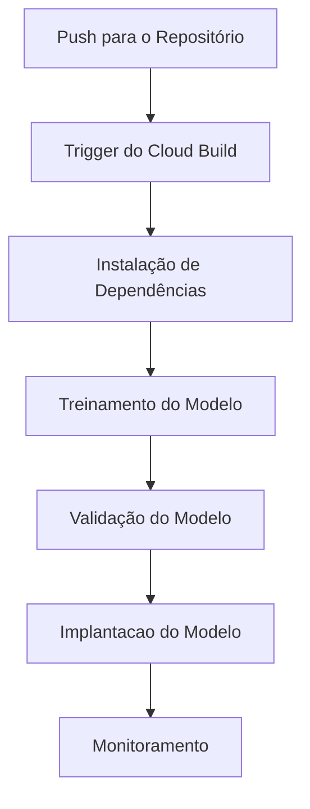

# 🧩 Conceitos e Arquitetura

Nessa página contém as respostas das perguntas teóricas elaboradas pelo cliente.

### 1. 🏗️ Infraestrutura e Orquestração

**Vertex AI Pipelines** e **Kubeflow Pipelines** são duas soluções para orquestração fluxos de **Machine Learning**. Ambos permitem criar, gerenciar e monitorar pipelines de ML, mas têm diferenças em termos de integração, facilidade de uso e casos de uso ideais. Abaixo as principais diferenças:

- Vertex AI Pipelines é um serviço totalmente gerenciado do Google Cloud, parte da plataforma Vertex AI, que simplifica a criação e execução de pipelines (esteiras) de ML.
- Ele é baseado no Kubeflow Pipelines, mas abstrai a complexidade.
- Kubeflow Pipelines é uma plataforma de código aberto para orquestração de workflows de ML, projetada para rodar em Kubernetes.
- Ele oferece mais flexibilidade e controle, mas requer configuração e gerenciamento de infraestrutura.

🧭 Vantagens do **Vertex AI Pipelines**:

- Uma solução pronta para uso com mínimo esforço de configuração.
- Focado em produtividade, você não quer gerenciar infraestruturas complexas.
- A empresa já usa outros serviços do Vertex AI e deseja integração.

🧭 Vantagens do **Kubeflow Pipelines**:

- A empresa precisa de controle total sobre a infraestrutura e pipelines.
- A empresa tem expertise em Kubernetes e deseja personalizar o ambiente do seu jeito.
- A empresa precisa de portabilidade entre diferentes nuvens (multi-cloud) ou ambientes on-premises, exemplo (Cloudera).

#### 1.1 🔧 Infraestrutura de ML

Para essa pergunta, tem que entender detalhes do cliente os tipos de modelos que serão implemendados. Mas, pensando em uma estrutura enxuta e escalável usando GCP, podemos pensar em uma arquitetura simples e objetiva:

##### 🕹️ Requisitos da Arquitetura

Modelos **Batch** 📦:

- Processamento periódico de médio volumes de dados.

*Exemplos*: previsões diárias, geração de relatórios, treinamento de modelos.

Modelos **Fast** ⚡:

- Respostas em tempo real ou near real-time.

*Exemplos*: previsões online, modelo de NLP, detecção facial, etc...

##### 🎯 Arquitetura Proposta

Steps:

1. Coleta de Dados 📶

- Cloud Pub/Sub: Para ingestão de dados em tempo real (*fast*).
- Cloud Storage: Para armazenamento de dados brutos em (*batch*).
  
*Exemplos*: APIs para previsões sob demanda, detecção de anomalias em tempo real.

2. Processamento de Dados 🧮

- Dataflow: Para processamento de dados em *batch* ou *streaming*.
- BigQuery: Para armazenar dados processados e estruturados (tabelas).

3. Treinamento de Modelos 🤖

- Vertex AI Training: Para treinar modelos de forma gerenciada.
- Cloud Storage: Para armazenar modelos treinados e backups dos mesmos.

3. Armazenamento / Controle de Modelos 🗂️

- Vertex AI Model Registry: Para versionamento e gerenciamento de modelos.
- Cloud Storage: Para armazenar arquivos de modelos (h5, pickle, joblib, etc...).

5. Deploy 🚀
   
- Vertex AI Endpoints: Para servir modelos em tempo real (*fast*).
- Cloud Functions ou Cloud Run: Para execução de modelos batch sob demanda ou em horários agendados.

Para caso de modelo batch disponibilização das inferências em uma tabela no BigQuery.

6. Monitoramento e Logging 🔍

- Cloud Logging: Coleta e armazenamento de logs em grande escala.
- Vertex AI Model Monitoring: Escalabilidade automática para monitorar a qualidade dos modelos em produção (drift + métricas).

7. Diagrama 📊

Fluxo básico para modelos **Fast** e **Batch**



### 2. 🕸️ CI/CD para Machine Learning

A implementação de um pipeline de *CI/CD* simples e eficiente, podemos seguir as seguintes steps e ferramentas detalhadas
a seguir.

#### 1.2 🔧 Estrutura dos Projetos

Os projetos de ML devem seguir um **template** que deve ser utilizada por todos os *cientistas de dados* do time. Usando o GitHub
como exemplo, podemos criar um template padrão dos projetos usando o cookie cutter. Sendo assim todos os projetos seguem as templates
padrão da empresa.

Estrutura do Projeto:

```txt
project-ml/
├── notebooks/
├── queries/
├── scripts/
├── src/
├── terraform/
├── cloudbuild.yaml
└── requirements.txt
```

#### 1.3 👨‍💻 Terraform

Usando o *Terraform* para definir a infraestrutura necessária, como buckets, serviços do Vertex AI, e outros recursos GCP.

*Exemplo*:

```terraform
provider "google" {
  project = "projeto-gcp-modelos"
  region  = "southamerica-east1-a"
}

resource "google_storage_bucket" "model_bucket" {
  name     = "bucket-modelos"
  location = "BR"
}

resource "google_vertex_ai_dataset" "dataset" {
  display_name = "meu-dataset"
  region       = "southamerica-east1-a"
}
```

#### 1.4 🏭 Cloud Build

Configuração de exemplo do *Cloud Build*:

```yaml
# Passo 1: Instalar dependências
- name: 'python:3.12'
  id: 'Instalar Dependências'
  entrypoint: 'pip'
  args: ['install', '-r', 'requirements.txt']

# Passo 2: Treinar o modelo
- name: 'python:3.12'
  id: 'Treinar Modelo'
  entrypoint: 'python'
  args: ['scripts/train.py']

# Passo 3: Validar o modelo
- name: 'python:3.12'
  id: 'Validar Modelo'
  entrypoint: 'python'
  args: ['scripts/validate.py']

# Passo 4: Deplot do modelo no Vertex AI
- name: 'gcr.io/cloud-builders/gcloud'
  id: 'Implantar Modelo'
  args: ['ai-platform', 'models', 'create', 'meu-modelo', '--region=southamerica-east1-a']
```

#### 1.5 🎲 Integração Vertex AI

- Usando o Vertex AI para treinar o modelo. Podemos enviar os jobs de treinamento diretamente a partir do Cloud Build.
- Registro do Modelo: Usando o Vertex AI Model Registry para ter o controle e gerenciamento do modelo.
- Deploy do Modelo: Após o treinamento, implantamos o modelo no Vertex AI.

#### 1.6 ⏰ Triggers

- Podemos usar Trigger de Push: No Cloud Build executar a pipeline automaticamente quando houver um push para o branch (main) do repositório no GitHub.
- Pull Request: Podemos configurar triggers para executar testes automatizados quando um (*pull request*) for aberto.

#### 1.7 😎 Boas práticas

É essencial manter uma documentação detalhada dos modelos, incluindo *runbooks* para orientar as operações, uma estratégia de *rollback* bem definida e, no caso de modelos *batch*, os horários programados para a execução das inferências, entre outros aspectos relevantes.

É fundamental implementar um monitoramento contínuo dos modelos, utilizando dashboards em ferramentas como Cloud Monitoring, Looker ou outras plataformas de visualização de dados, para acompanhar métricas de desempenho e identificar possíveis drifts. Além disso, é importante configurar alertas automatizados que notifiquem o responsável pelo modelo em caso de problemas, garantindo uma resposta rápida e eficiente.

Nesse ponto, é importante salientar que, dependendo do problema que o modelo busca resolver, é possível implementar uma pipeline de re-treinamento automático, que será acionada sempre que uma métrica específica atingir um nível de degradação pré-definido. Essa abordagem ajuda a manter a eficácia do modelo ao longo do tempo, adaptando-se às mudanças nos dados e no ambiente.

É imprescindível realizar testes e validações *robustas*, usar Feature Store, scripts automatizados que assegurem a execução de todos os testes necessários antes do deploy do modelo. Essa prática garante a confiabilidade e a qualidade do modelo, identificando possíveis falhas ou inconsistências que possam impactar seu desempenho em produção.

*Exemplos*:

 - Testes unitários.
 - Uso de Feature Stores.
 - Volumetria dos dados.

#### 1.8 📊 Diagrama

Fluxo da pipeline



#### 1.9 ⏳ Gerenciamento com Vertex AI Model Registry

Para fazer o versionamento dos modelos, usamos o Vertex AI Model Registry. Ele facilita o controle de diferentes versões de um modelo, garantindo rastreabilidade e a capacidade de reverter para versões anteriores, caso necessário.

**🎢 Steps para Registrar um Modelo**:

Lembrando as steps abaixo estaram dentro de uma pipeline usando o terraform, mas para facilitar
vamos fazer step by step.

Após treinar um modelo, podemos registrá-lo.

*Exemplo*:

```sh
gcloud ai models upload --region=REGION --display-name=MODEL_NAME --container-image-uri=IMAGE_URI
```

Automáticamente o modelo será registrado com a versão **v1**. Podemos listar os modelos registrados:

```sh
gcloud ai versions list --model=MODEL_NAME --region=REGION
```

Agora, suponhamos que esse modelo sofreu um re-treino. Subimos a nova versão do modelo re-treinado:

```sh
gcloud ai models set-default-version --model=MODEL_NAME --region=REGION --version=VERSION_NAME
```

Agora a versão sera a **v2**. A pipeline rodou alguns testes e verificamos que o modelo anterior ainda
era melhor. Então é necessário fazer o rollback para v1.

```sh
gcloud ai models set-default-version --model=MODEL_NAME --region=REGION --version=v1
```

Pronto 🤟! O modelo anterior estara funcionando novamente. Esses são os benefícios do versionamento no Vertex AI Model Registry. 

- 👉 Rastreabilidade: Mantém um histórico completo de todas as versões do modelo.
- 👉 Facilidade de Reversão: Permite reverter para versões anteriores rapidamente em caso de problemas.
- 👉 Colaboração: Facilita o trabalho em equipe, permitindo que diferentes versões sejam testadas e comparadas.

### 3. 🔍 Monitoramento e Observabilidade 

Já falamos um pouco acima do monitoramento. Mas vamos detalhar mais.

O drift é uma métrica de monitoramento, ocorre quando a relação entre as variáveis de entrada e a variável de saída muda ao longo do tempo, 
afetando a performance do modelo. 

*Exemplo*:

O modelo foi treinado usando dados do passado para prever o presente e futuro. Porém esses dados ao longo
do tempo vão mudando, então o drift verifica esse desvio entre as mudanças nas variavels.

Usando a **GCP**, podemos usar ferramentas como *Vertex AI Model Monitoring* para detectar esse tipo de problema.

- 👉 Ao fazer o deploy do modelo podemos habilitar o monitoramento contínuo, para rastrear o drift.
- 👉 Podemos definir os (thresholds) para métricas, e quando se degradar alertamos via email o time, por exemplo.

Como podemos reagir ao drift:

- 👉 Retreinar o modelo com dados mais recentes.
- 👉 Ajustar os hiperparâmetros do modelo.
- 👉 Investigar se houve mudanças bruscas nos dados.

Além do drift de dados, existe outras métricas que são importantes acompanhar como *F1-Score*, *AUC-ROC*, *Acurácia*, *MAE*, *RMSE*, entre
outras. Em casos de modelos *Fast*, acompanhar a latências de respostas dos *requests*.

```Nota 📑```: Esse processo em alguns casos pode ser complexo, então podemos criar uma pipeline de re-treino automática para
treinar o modelo com dados mais recentes ou investigar o problema antes de tentar re-treinar automaticamente. 

Para o ferramental na *GCP* podemos usar para monitoramento:

- 👉 Vertex AI Model Monitoring: Automatiza o monitoramento de métricas e alertas.
- 👉 Cloud Monitoring: Configura alertas personalizados para métricas específicas.
- 👉 BigQuery: Armazena logs e métricas para análise histórica.
- 👉 Dataflow: Processa dados em tempo real para monitoramento contínuo.
- 👉 Escrever um solução personalizada usando Cloud Run.

### 4. Segurança e Compliance 🔍

A GCP oferece alguns serviços e práticas recomendadas para proteger os dados. Algumas são padrões nos
serviços como *AES-256*, *TLS* para garantir que os dados sejam criptografados durante as transferência entre serviços.

É importante fazer o controle dos acessos via *IAM*. 

*Exemplos*:

- Definir permissões granulares e garantir que apenas usuários e serviços autorizados tenham acesso aos dados.
- Aplicar o princípio do menor privilégio, concedendo apenas as permissões necessárias.

Criação de Service Accounts:

- Utilizar contas de serviço para autenticar aplicações, evitando o uso de credenciais de usuários humanos.

Usar VPC 🌥️:

Configurando limites para restringir o acesso a serviços como BigQuery, Cloud Storage e Vertex AI, evitando vazamentos de dados.

Anonimização de Dados

*Exemplos*:

- Data Loss Prevention (DLP) API: Identificar e anonimizar informações sensíveis, como CPFs, números de cartão de crédito ou endereços de e-mail.
- Pseudonimização: Substitua identificadores diretos por valores pseudônimos, mantendo a utilidade dos dados para treinamento sem expor informações sensíveis.

Usar **ambientes seguros** para treino, usando serviços como:

- Vertex AI: O Vertex AI oferece um ambiente seguro para treinar modelos, com integração nativa ao IAM e criptografia de dados.
- AI Platform Notebooks: Utilizar notebooks gerenciados com controles de acesso e criptografia para desenvolver e testar modelos.

Ativar IPs e VPCs:

Configurar *redes privadas* para garantir que o tráfego de dados não seja exposto à internet pública.

Usar o Cloud Audit Logs:

- Habilitar logs de auditoria para rastrear todas as ações realizadas nos serviços do GCP, como acessos a dados e operações de treinamento.

Para proteger pipelines de treinamento, usaria as ferramentas e as praticas a seguir: 

**IAM 🔑**

- Seguindo o princípio do menor privilégio possível.
- Papéis (Roles) pré-definidos e customizados.
- Grupos de usúarios (por exemplo, *data-scientists*, *ml-engineers*, *data-engineers*), em vez de a usuários individuais.

**Service Accounts 🔑**

Contas de serviço são usadas para autenticar aplicações e serviços, evitando o uso de credenciais pessoais.

- Contas de Serviço Específicas: Dedicadas para pipelines de treinamento e inferência.
- Limitação de Escopo: O escopo das contas de serviço apenas às permissões necessárias para executar suas tarefas.

Outras práticas podem ser adotas como criação de token e expiração dos mesmos. Usuários e chaves específicas para o 
CI/CD dos repositórios de código fonte, usar serviços como Secret Manager, implementação da auditoria de logs, usando 
Cloud Audit Logs, Cloud Monitoring, Security Command Center, existe uma serie de possibilidades e ferramental disponivel.

