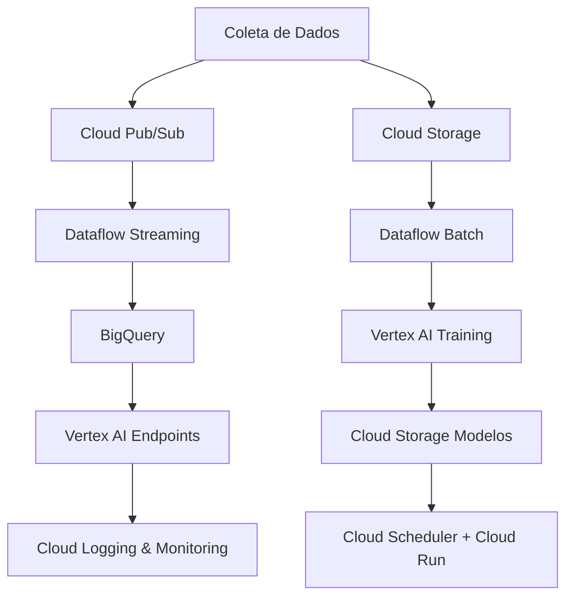

# 🧩 Conceitos e Arquitetura

Nessa página contém as respostas das perguntas teóricas elaboradas pelo cliente.

### 1. 🏗️ Infraestrutura e Orquestração

**Vertex AI Pipelines** e **Kubeflow Pipelines** são duas soluções para orquestração fluxos de **machine learning**. Ambos permitem criar, gerenciar e monitorar pipelines de ML, mas têm diferenças em termos de integração, facilidade de uso e casos de uso ideais. Abaixo as principais diferenças:

- Vertex AI Pipelines é um serviço totalmente gerenciado do Google Cloud, parte da plataforma Vertex AI, que simplifica a criação e execução de pipelines de ML.
- Ele é baseado no Kubeflow Pipelines, mas abstrai a complexidade.
- Kubeflow Pipelines é uma plataforma de código aberto para orquestração de workflows de ML, projetada para rodar em Kubernetes.
- Ele oferece mais flexibilidade e controle, mas requer configuração e gerenciamento de infraestrutura.

🧭 Vantagens do **Vertex AI Pipelines**:

- Você quer uma solução pronta para uso com mínimo esforço de configuração.
- Você está focado em produtividade e não quer gerenciar infraestruturas complexas.
- Você já usa outros serviços do Vertex AI e deseja integração.

🧭 Vantagens do **Kubeflow Pipelines**:

- Você precisa de controle total sobre a infraestrutura e pipelines.
- Você tem expertise em Kubernetes e deseja personalizar o ambiente do seu jeito.
- Você precisa de portabilidade entre diferentes nuvens ou ambientes on-premises.

#### 1.1 🔧 Infraestrutura de ML

Tem que entender detalhes do cliente os tipos de modelos que serão implemendados. Mas, pensando em uma estrutura enxuta e escalavel usando GCP. Eu proponho o seguinte:

##### 🕹️ Requisitos da Arquitetura

Modelos **Batch** 📦:

- Processamento periódico de médio volumes de dados.

Exemplos: previsões diárias, geração de relatórios, treinamento de modelos.

Modelos **Fast** ⚡:

Respostas em tempo real ou near real-time.

##### 🎯 Arquitetura Proposta

1. Coleta de Dados 📶

- Cloud Pub/Sub: Para ingestão de dados em tempo real (fast).
- Cloud Storage: Para armazenamento de dados brutos em lote (batch).
  
Exemplos: APIs para previsões sob demanda, detecção de anomalias em tempo real.

2. Processamento de Dados 🧮 

- Dataflow: Para processamento de dados em batch e streaming.
- BigQuery: Para armazenar dados processados e estruturados.

3. Treinamento de Modelos 🤖

- Vertex AI Training: Para treinar modelos de forma gerenciada.
- Cloud Storage: Para armazenar modelos treinados e backups.

3. Armazenamento / Controle de Modelos 🗂️

- Vertex AI Model Registry: Para versionamento e gerenciamento de modelos.
- Cloud Storage: Para armazenar arquivos de modelos (heights, pickle, etc.).

5. Deploy 🚀
   
- Vertex AI Endpoints: Para servir modelos em tempo real (fast).
- Cloud Functions ou Cloud Run: Para execução de modelos batch sob demanda ou em horários agendados.

Para caso de modelo batch disponibilização das inferências em uma tabela no Big Query cliente.

6. Monitoramento e Logging 🔍

- Cloud Logging: Coleta e armazenamento de logs em grande escala.
- Vertex AI Model Monitoring: Escalabilidade automática para monitorar a qualidade dos modelos em produção (drift e métricas).

7. Diagrama 📊

Fluxo básico para modelos **Fast** e **Batch**

### 2. 🕸️ CI/CD para Machine Learning

